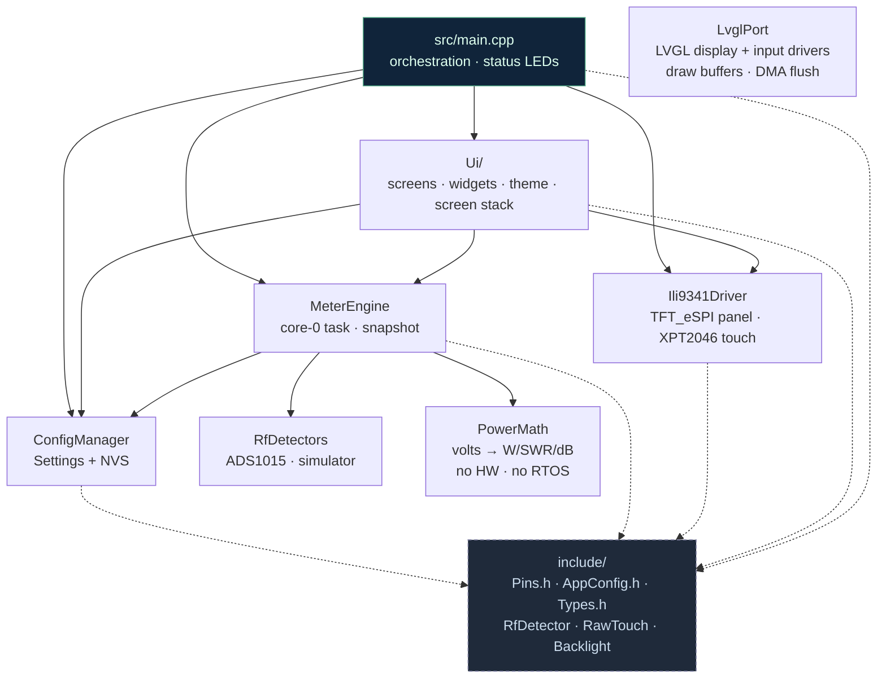

# PSWR_CYD — RF Power & SWR Meter

Firmware for a forward/reflected power and SWR meter, with multiple display modes, an on-screen
configuration menu and touch calibration. It builds for **two** boards from the same sources —
the **ESP32-2432S028R "Cheap Yellow Display" (CYD)** and a plain **ESP32 Dev Module driving a
discrete 2.8" ILI9341 + XPT2046 module** — selected by one line in `platformio.ini`.

**Author:** Marcelo R. Gadotti — PP5MGT · **Version:** 1.00 · Licensed under **GPL v3 or later**.

A ground-up implementation: the dual-core measurement engine, the detector abstraction and the
LVGL user interface are all new. The *Multi Display RF Power and SWR Meter* by Loftur E. Jonasson
(TF3LJ/VE2AO), with later additions by J.G. Holstein, was used as the **reference** for how the
instrument should behave — and its measurement algorithms (the AD8307 two-point dBm conversion, the
peak/PEP/averaging windows and the calibration procedure, all now in `PowerMath`) were carried over
faithfully on purpose. A meter that reads differently from the one its users calibrated against
would be a worse instrument, not a better one.

> This program comes with ABSOLUTELY NO WARRANTY. See <https://www.gnu.org/licenses/> for the full
> licence text.

## Hardware

**Two boards, one firmware.** The target is a single build flag: change `default_envs` in
`platformio.ini`, or pass `pio run -e <env>`. No source file is edited to change board.

| | `[env:cyd]` | `[env:esp32dev_ili9341]` |
|---|---|---|
| Board | ESP32-2432S028R "Cheap Yellow Display" — everything integrated | ESP32 Dev Module + a discrete 2.8" ILI9341 + XPT2046 module (the common red "TJCTM24028-SPI" board) |
| Select with | `-D BOARD_CYD` | `-D BOARD_ESP32_ILI9341` |
| Panel bus | **HSPI** (`USE_HSPI_PORT`), IO_MUX pins, 55 MHz | **VSPI**, IO_MUX pins, 40 MHz |
| Panel init | `ILI9341_2_DRIVER`, colours **inverted** | `ILI9341_DRIVER`, not inverted |
| Touch bus | **VSPI** | **HSPI** |
| Backlight | `TFT_BL` GPIO 21 | `TFT_BL` GPIO 27 |
| Status LEDs | onboard RGB, active-low | none fitted; one flag away if you wire them |
| I²C (ADS1015) | SDA 27 / SCL 22 | SDA 21 / SCL 22 |

> **The invariant both boards keep: the touch controller is never on the panel's SPI host.** The
> flush path deliberately leaves a DMA transfer in flight so LVGL can render the next area against
> it (§ `LvglPort.cpp`), and a touch read poking the same peripheral mid-transfer corrupts the
> screen at random — intermittently, under load, which is the worst way to find it. `Pins.h`
> refuses to compile a board whose `BOARD_TOUCH_SPI_BUS` collides with `USE_HSPI_PORT`, so the
> invariant is enforced rather than merely documented.

Common to both:

| Peripheral | Detail |
|---|---|
| Display | ILI9341 320×240 via **TFT_eSPI** (pins in `platformio.ini` build flags) |
| Backlight | LEDC channel 0 at 5 kHz / 8 bits; duty floored at 10% so a menu can never leave the operator holding a black panel |
| Touch | **XPT2046** resistive, on its own SPI host |
| ADC | **ADS1015** (I2C `0x48`…`0x4B`, one per coupler); `AIN0` = forward, `AIN1` = reflected |
| Cores | sampling + math on core 0, **LVGL 8.4** user interface on core 1 |

Where a pin is *defined* follows the same split in both tables below: the seven `TFT_*` lines are
TFT_eSPI build flags in `platformio.ini` (that library is configured by macros at compile time and
cannot read a `constexpr`), everything else is a `constexpr` in the board header. One copy of each,
no second place to silently disagree.

### Pinout — `cyd`

Nothing to wire: the ESP32, the panel, the touch controller and the RGB LED are one board. This is
a transcription of that wiring, for reading a schematic or checking a probe — not a build step. The
only thing the operator adds is the ADS1015, on the free pins brought out at **CN1**.

| Signal | GPIO | Bus / note |
|---|---|---|
| `TFT_MISO` | 12 | HSPI (IO_MUX) |
| `TFT_MOSI` | 13 | HSPI (IO_MUX) |
| `TFT_SCLK` | 14 | HSPI (IO_MUX) |
| `TFT_CS` | 15 | HSPI (IO_MUX) |
| `TFT_DC` | 2 | |
| `TFT_RST` | −1 | no GPIO — panel reset is tied to the ESP32's own reset line |
| `TFT_BL` | 21 | backlight, driven by LEDC (not TFT_eSPI's on/off) |
| `TOUCH_CLK` | 25 | VSPI |
| `TOUCH_MISO` | 39 | VSPI (input-only pin) |
| `TOUCH_MOSI` | 32 | VSPI |
| `TOUCH_CS` | 33 | VSPI |
| `TOUCH_IRQ` | 36 | input-only |
| `LED_R` | 4 | SWR alarm — active **low** |
| `LED_G` | 16 | power detected — active **low** |
| `LED_B` | 17 | unused |
| `I2C_SDA` | 27 | ADS1015, CN1 |
| `I2C_SCL` | 22 | ADS1015, CN1 |

### Pinout and wiring — `esp32dev_ili9341`

Here the pin map *is* the wiring instruction. This table is the same one carried in
`include/boards/board_esp32_ili9341.h` beside the constants, and the two are meant to be changed
together:

| Module | ESP32 | Bus / note |
|---|---|---|
| VCC | 3V3 | **not 5 V** — the logic is 3.3 V whatever the silkscreen says about the regulator |
| GND | GND | |
| CS | GPIO 5 | VSPI (IO_MUX) — `TFT_CS` |
| RESET | GPIO 4 | `TFT_RST`; tie to EN and set `TFT_RST=-1` to free the pin |
| DC / RS | GPIO 2 | `TFT_DC` |
| SDI / MOSI | GPIO 23 | VSPI (IO_MUX) — `TFT_MOSI` |
| SCK | GPIO 18 | VSPI (IO_MUX) — `TFT_SCLK` |
| LED | GPIO 27 | `TFT_BL`; tie to 3V3 instead and set `BOARD_HAS_BACKLIGHT_PWM 0` |
| SDO / MISO | GPIO 19 | VSPI (IO_MUX) — `TFT_MISO` |
| T_CLK | GPIO 25 | HSPI — `TOUCH_CLK` |
| T_CS | GPIO 33 | HSPI — `TOUCH_CS` |
| T_DIN | GPIO 32 | HSPI — `TOUCH_MOSI` |
| T_DO | GPIO 39 | HSPI — `TOUCH_MISO`; input-only pin, which is what a MISO line wants |
| T_IRQ | GPIO 36 | `TOUCH_IRQ`; input-only |
| ADS1015 | SDA 21 / SCL 22 | `I2C_SDA` / `I2C_SCL` — the ESP32 Arduino default pair |
| *(status LEDs)* | 16 / 17 / 26 | **not fitted by default.** `LED_R` / `LED_G` / `LED_B`, wired but inert until `BOARD_HAS_RGB_LED` is set to 1; the pins are already reserved so fitting them later is one flag, not a re-wire |

The touch lines get their own four pins rather than sharing the panel's, which is what buys the
second SPI host and the invariant above. Pins deliberately avoided: **6–11** are the flash, **12**
(MTDI) is strapped at boot and a module that pulls it up will not start — which is why the touch bus
skips the HSPI IO_MUX pins even though it is on the HSPI host, harmless at 2 MHz through the GPIO
matrix — and **34–39** are input-only, so only `T_DO` and `T_IRQ` are put there.

**Run Touch Calibrate first.** The compile-time mapping in the board header is the CYD's, carried
over as a starting point; on a discrete panel it is a guess.

### Board constants that are not pins

Every value above has a companion in the same board header that decides what the pin *means*. These
are the ones worth knowing before probing anything:

| Constant | `cyd` | `esp32dev_ili9341` | What it decides |
|---|---|---|---|
| `BOARD_TFT_INVERT` | 1 | 0 | whether the driver calls `invertDisplay(true)`. Wrong value = a display that works perfectly, in negative |
| `BOARD_TFT_ROTATION` | 1 | 1 | TFT_eSPI rotation; the whole UI is laid out for 320×240 landscape |
| `BOARD_TOUCH_ROTATION` | 1 | 1 | XPT2046 rotation — the flag to change if touch answers on the wrong axis |
| `TOUCH_MIN_X` … `TOUCH_MAX_Y` | 200…3700 / 240…3800 | same, as a starting guess | default raw-to-screen mapping, overwritten by Touch Calibrate and kept in NVS. Swap MIN and MAX on an axis that responds backwards — a reversed span is accepted on purpose |
| `TOUCH_MIN_PRESSURE` | 300 | 300 | raw counts below which a press is ignored. Raise it against phantom taps, lower it if light presses are missed |
| `TFT_BACKLIGHT_ON` | `HIGH` | `HIGH` | which level lights the panel (a `platformio.ini` flag, since TFT_eSPI reads it too) |
| `BOARD_HAS_BACKLIGHT_PWM` | 1 | 1 | whether `TFT_BL` is a GPIO this firmware drives. 0 = LED tied to 3V3; the brightness setting is then stored and ignored |
| `BOARD_HAS_RGB_LED` | 1 | 0 | whether the status LEDs exist |
| `BOARD_LED_ACTIVE_LOW` | 1 | 0 | which level lights them |
| `I2C_HZ` | 400 kHz | 400 kHz | ADS1015 bus clock |

> If no ADS1015 is detected at boot, the meter runs on a **randomly walking mock** so the whole
> interface — autoscale, bars, scope and all — can be exercised without RF hardware. It deliberately
> moves: a frozen mock hides how much the UI actually costs.
>
> It simulates **two couplers**, not one, because the coupler selector and the per-coupler
> calibration are otherwise unreachable without two converters strapped to different addresses. They
> are different instruments on purpose — `CPL1` a 100 W class transceiver into a mediocre load,
> `CPL2` an amplifier into a good one — so switching between them changes the decade, the autoscale
> range and the SWR band at once:
>
> | | up to | SWR |
> |---|---|---|
> | **CPL1** | 110 W | 1.1 – 2.5 |
> | **CPL2** | 1600 W | 1.1 – 1.5 |

## Architecture

The project follows the native PlatformIO layout, separating hardware, persistence and UI.
`src/main.cpp` contains **only orchestration** (`setup()`, the core-1 UI task and the status LEDs).



> Solid arrows = compile/runtime dependency · dashed arrows = use of the shared headers in
> `include/`. There are no circular dependencies.
>
> Three interfaces in `include/` keep the layers genuinely separable, and all three are abstract, with
> no dependencies of their own: **`RfDetector`** lets `MeterEngine` accept any front-end (so
> `PowerMath` never sees I2C, and the detectors never see the math), **`RawTouch`** lets the
> calibration screen reach raw touch counts, and **`Backlight`** gives the brightness screen the one
> method it needs — the last two so that no screen has to pull in TFT_eSPI. They are separate
> contracts rather than one because a board could easily have a backlight and no touch panel.
>
> **Swapping the ADC is meant to cost one line.** `RfDetector` carries `diagId()`, a debug-screen
> identifier (the I2C address, for this driver) that defaults to 0 so a new front-end only overrides
> it if it has one to report, and `Ads1015Detector::probeAll()` does the "construct one instance per
> address, probe it, report who answered" work in a single call that hands back `RfDetector*`s.
> `MeterEngine.cpp` names the concrete ADS1015 type in exactly that one call — a different ADC
> replaces its `#include` and that line, and nothing else in the project changes.
>
> **`PowerMath` is the piece worth reusing elsewhere**: no Arduino, no FreeRTOS, no hardware — feed
> it detector volts and it returns a filled `MeterReadings`. It is also, with `UiFormat`, one of the
> two parts that can be unit-tested on the host (`pio test -e native`) — which matters because
> between them they hold the physics and the readout it is presented through.

### Directory layout

```
include/                  # shared constants and types (no logic)
  Pins.h                  #   board SELECTOR: picks one boards/*.h and checks the contract
  boards/                 #   one header per supported board - pins + feature flags
    board_cyd.h           #     ESP32-2432S028R "Cheap Yellow Display"
    board_esp32_ili9341.h #     ESP32 Dev Module + discrete 2.8" ILI9341 + XPT2046
  AppConfig.h             #   VERSION, cal/threshold defaults, buffers, mock, MEMORY BUDGET
  Types.h                 #   DetectorType, DisplayMode, CalPoint, Settings, MeterReadings
  RfDetector.h            #   interface: any RF front-end (volts out)
  RawTouch.h              #   interface: raw touch counts, for calibration
  Backlight.h             #   interface: panel brightness, for the settings UI
lib/
  ConfigManager/          # Settings + NVS persistence (Preferences)
  RfDetectors/            # ADS1015 front-end + simulator, both implementing RfDetector
  PowerMath/              # detector volts -> power/PEP/SWR.  Portable: no HW, no RTOS
  MeterEngine/            # core-0 task wiring a detector to the math + snapshot handoff
  Ili9341Driver/          # TFT_eSPI panel + XPT2046 touch (hardware only)
  LvglPort/               # LVGL display + input drivers, draw buffers, DMA flush
  Ui/                     # theme, formatting, screen stack, widgets, all screens
src/
  main.cpp                # application orchestration
legacy/
  main_original.cpp       # original monolithic version (reference/backup)
```

### Module responsibilities

| Module | Responsibility | Key API |
|---|---|---|
| **ConfigManager** | Owns `Settings`; loads/validates/persists them in NVS | `begin` · `save` · `saveCal` · `resetDefaults` · `settings()` |
| **RfDetectors** | `Ads1015Detector` (raw I2C register access, named after Adafruit_ADS1X15's own API so it reads like that library without the dependency) and `MockDetector` (random walk that inverts the live calibration), both `RfDetector` | `begin` · `present` · `read` · `diagId` · `probeAll` (static) |
| **PowerMath** | Detector volts → instantaneous/peak/PEP power, averages, SWR and the alarm flags. Portable and reentrant; windows are counted in **samples**, so the caller owns the cadence | `reset` · `addSample` · `updateSwr` |
| **MeterEngine** | The thin coupling: probes for a real detector, runs the core-0 task at `SAMPLE_MS`, publishes the snapshot under a spinlock | `begin` · `start` · `syncReadings` · `readings()` · `detectorPresent()` |
| **Ili9341Driver** | TFT panel + touch controller + backlight PWM, plus the `RawTouch` and `Backlight` contracts used by the calibration and brightness screens (no business logic) | `begin` · `beginDma` · `tft()` · `readTouch` · `readRaw` · `setTouchCal` · `setBrightness` |
| **LvglPort** | The only file including both `lvgl.h` and `TFT_eSPI.h`: draw buffers, DMA `flush_cb`, `indev` `read_cb` | `begin` · `endFrame` · `takeFlushStats` |
| **Ui/** | Screen stack + deferred navigation (`UiApp`), theme, pure formatting/autoscale (`UiFormat`), widgets (`PowerBarWidget`/`SwrBarWidget`/`ScopeWidget`) and ten screens (boot, mode intro, meter, menu, list, adjust, calibrate, touch calibrate, debug, about) | `UiApp::begin` · `tick` · `requestPush` · `requestPop` |

### Concurrency

Two FreeRTOS tasks, one pinned to each core. The Arduino loop task is deleted at the end of
`setup()`, so `loop()` never runs.

| Task | Core | Period | Owns |
|---|---|---|---|
| `meter` | 0 | `SAMPLE_MS` (2 ms) | ADS1015 / I2C, the mock, all power/PEP/SWR math |
| `ui` | 1 | `UI_TICK_MS` (5 ms) | LVGL, panel, XPT2046 touch, status LEDs |

The measurement windows (`BUF_SHORT`, `AVG_BUF1S`, PEP) are counted in **samples**, so the math has
to advance exactly once per acquisition — that is why it runs in the meter task rather than
alongside the UI. Redraws, an open config menu or the calibration screen can block core 1 for as
long as they like without disturbing the measurement cadence.

The two tasks share exactly one thing under lock: a `MeterReadings` snapshot, copied under a
spinlock. Core 0 publishes it every sample; the UI takes its own copy with `meter.syncReadings()`
and then reads it through `meter.readings()` for the rest of the frame, so every value on screen
belongs to the same instant. Task stacks, priorities and core assignments live in `AppConfig.h`.

The only other crossing is one `std::atomic<bool>`: `clearSwrAlarm()` stores a flag that the meter task
acts on at the top of its next cycle, on the core that owns the readings. A request landing in the
window between the task loading the flag and clearing it is lost — that is an acknowledging tap with
the alarm still on screen, so the operator taps again, which costs less than a spinlock around a
bool would.

> `Settings` is the one piece of state written by the UI (menu, calibration) and read by the meter
> task. `Settings::coupler` is a `std::atomic<uint8_t>`, since it is the one value the two cores
> exchange; the rest of the struct is read by the meter task only while a change is being written, so
> the worst case is a single 2 ms cycle computing with a mixed view during a settings change —
> deliberately left unlocked.

### Multiple couplers

Up to `MAX_COUPLERS` (4) ADS1015s can share the bus, one per directional coupler. Support for that is
one probe, one byte and one lookup, chained through three modules:

1. **Discovery, once at boot.** `MeterEngine::begin()` calls
   [`Ads1015Detector::probeAll()`](lib/RfDetectors/Ads1015Detector.cpp), which constructs one instance
   per possible address (`0x48`…`0x4B`), probes each with an address-only I2C transaction, and returns
   `RfDetector*`s to whichever answered — **in address order**, so if only `0x49` and `0x4B` are
   fitted they still become `CPL1` and `CPL2`, not "coupler 2 and 4". The count becomes
   `couplerCount_`; zero falls back to `MOCK_COUPLERS` simulated couplers.
2. **Switching, one byte, no lock.** The `CPL` front-panel button
   ([`MeterScreen::onFrontPanel`](lib/Ui/MeterScreen.cpp)) only writes `Settings::coupler`. The meter
   task on core 0 notices the byte changed at the top of its next sample and calls
   `MeterEngine::selectCoupler()`, which repoints `detector_` and calls `PowerMath::reset()` — the
   peak/PEP/averaging windows hold samples scaled by the OTHER coupler's calibration, and left in
   place they would read plausible nonsense for a second or two. No spinlock needed: `coupler` is one
   `std::atomic<uint8_t>`, the same reasoning `clearSwrAlarm()` above relies on.
3. **Calibration follows the index.** `Settings::cal[MAX_COUPLERS]` holds one `Calibration` per
   coupler; `Settings::activeCal()` indexes it by `coupler − 1`, so `PowerMath` never has to know
   which coupler is selected — it just asks for "the active one" and gets the right numbers.
4. **Diagnosis.** `MeterEngine::activeAddress()` reads `detector_->diagId()` (0 when simulated), shown
   on the debug screen as `CPLn of N   ADS1015 @ 0xXX` — the fastest way to tell a coupler that never
   appears is an `ADDR`-strapping mistake rather than a wiring one.

### Conventions

- Arduino-style interfaces: `begin()`, `update()`, `save()`, `load()`.
- Classes in `PascalCase`, methods in `camelCase`, constants in `UPPER_SNAKE_CASE`, private members
  with a trailing `_`.
- `constexpr` / `enum class` / `const` preferred over `#define`; no dynamic allocation; minimal RAM.
- Stateful components modelled as classes (including the `PowerBarWidget` / `SwrBarWidget` /
  `ScopeWidget` widgets).
- **Never write an unchanged value to an LVGL object.** `lv_label_set_text()`,
  `lv_obj_set_width()` and the `lv_obj_set_style_*()` setters all invalidate unconditionally, with
  no check of their own — and LVGL repaints an object's whole box, not the pixels that changed.
  Guard every per-frame setter with a cached previous value; where a widget changes continuously,
  draw it in `LV_EVENT_DRAW_MAIN` and invalidate only the span that moved.

## Measurement equations

Everything below is in [`PowerMath`](lib/PowerMath/PowerMath.cpp) unless stated otherwise, and every
constant named in capitals is in [`AppConfig.h`](include/AppConfig.h). The algorithms are a faithful
port of TF3LJ/VE2AO's, **including the odd-looking parts** — a meter that reads differently from the
one its users calibrated against would be a worse instrument. Treat a change here as a change to
measurement accuracy, not to code style.

Symbols: `Vf`/`Vr` are the detector output volts, `Pf`/`Pr` forward and reflected power in mW, and
`f`/`r` (`fInst`/`rInst` in the code) the *amplitude*-like quantities the SWR is taken from.

### 1 · ADC → detector volts

ADS1015, single-shot, PGA ±4.096 V, 12 bits, so one count is 4.096 V / 2048:

```
V = max(raw, 0) × 0.002          raw = conversion register >> 4   (12-bit, left-aligned)
```

The clamp at zero is deliberate: these detectors are single-ended positive, so a negative code is
offset noise, not a negative signal. `AIN0` = forward, `AIN1` = reflected.

### 2a · AD8307 path — two-point log fit

Each coupler stores **two calibration points**, and each point carries **one reference level per
channel**: `(Df1, Vf1)` and `(Df2, Vf2)` for forward, `(Dr1, Vr1)` and `(Dr2, Vr2)` for reverse,
with `D` in dBm. The AD8307 is logarithmic, so volts against dBm is a straight line and two points
define it:

```
slope_f = (Df2 − Df1) / (Vf2 − Vf1)        [dB per volt]
slope_r = (Dr2 − Dr1) / (Vr2 − Vr1)

dBm_f   = (Vf − Vf1) × slope_f + Df1
dBm_r   = (Vr − Vr1) × slope_r + Dr1
```

**Two anchors, not one — this is the one structural departure from the reference's `cal_t`.**
Forward and reverse are independent fits. They are measured together when the coupler is fed
forwards, which is why one shared `D` per point worked for the original; they are *not* when it is
fed backwards, which is exactly what §7's reverse-only path is for. Sharing the anchor meant that
storing a reverse point also moved the forward fit's x-axis while leaving its stored volts alone,
so the forward reading shifted by the whole gap between the two reference levels — a meter whose
forward pair sat at 40 dBm and whose reverse channel was then calibrated at 20 dBm read **one
hundredth of the true power**, silently. `revDb10m` in [`CalPoint`](include/Types.h) is what keeps
the two lines apart; it costs nothing in RAM, since the padding after a lone `int16_t` was already
two bytes wide.

Nothing guarantees the two points sit at different voltages: `SET P1` and `SET P2` are separate
presses, so the pair is legitimately half-updated in between, and the reverse-only calibration path
never touches the forward pair at all. Dividing by a span of zero gives `inf`, which becomes a NaN
`netPowerDb` — and since the peak and PEP windows are maximum scans, they latch it and the meter
reads nonsense until it is power-cycled. So when `|Vf2 − Vf1|` (or the reverse pair) falls below
`CAL_MIN_SPAN_V` = 0.05 V, **that channel falls back to the AD8307's nominal slope**,
`1000 / LOGAMP_SLOPE` dB/V: wrong by whatever the calibration would have corrected, but bounded,
monotonic and still tracking the carrier.

Then, if `dBm_r > dBm_f`, the two are **swapped** and `reverse` is set — that is how the meter copes
with being wired backwards, and it is why everything downstream can assume "forward" is the larger.

```
f  = 10^(dBm_f / 20)      Pf = f²           (equivalently Pf = 10^(dBm_f / 10), in mW)
r  = 10^(dBm_r / 20)      Pr = r²
```

`f` and `r` are amplitudes (√mW, i.e. proportional to volts into 50 Ω), which is exactly what §6
needs. Note `D` is stored as `db10m` = dBm × 10 in an `int16_t`, so the code divides by 10 wherever
a real dBm is wanted.

### 2b · Diode / Bruene path — one-point scale

Forward and reflected are swapped first (larger wins, same `reverse` flag). Then the diode drop is
removed, the reading is converted from peak to RMS, and the coupler ratio is undone:

```
V' = (V − Vdrop) / √2 + Vdrop      for V ≥ Vdrop,   otherwise V' = V
V_line = V' × N × meter_cal        N = BRIDGE_COUPLING = 24,  Vdrop = D_VDROP = 0.25 V
P[mW]  = 1000 × V_line² / 50
```

Only the part **above** the diode drop is scaled by √2, because the drop is a DC offset the detector
adds, not part of the sinusoid.

### 3 · Net power

```
Pf ← min(Pf, 9 000 000 mW)                     9 kW ceiling, so one wild sample cannot
Pr ← min(Pr, 9 000 000 mW)                     poison the peak and average windows
P_net    = |Pf − Pr|
P_net,dB = 10 × log10(P_net)                   dBm; floored at −90 when P_net ≤ 1e−9
```

### 4 · Peak hold and PEP

Both are sliding **maxima**, held as centi-dB integers (`(int32_t)(100 × dB)`, truncated) so the
scan over the window is integer work:

```
peak_dB = max over the last BUF_SHORT (50) samples          → 100 ms at SAMPLE_MS = 2 ms
pep_dB  = max over the last W peak values, W = PEP_OPTIONS[pepIdx] ∈ {1, 10, 25}
pep_dB  = max(pep_dB, peak_dB)                              → never below the live peak
```

The PEP ring advances **once per completed peak window**, not once per sample, so its window is
`W × BUF_SHORT × SAMPLE_MS` = 100 ms / 1 s / 2.5 s. Converting back:

```
P_peak = 10^(peak_dB / 10)        P_pep = 10^(pep_dB / 10)     [mW]
```

### 5 · Averages

Sliding sums, O(1) per sample rather than a rescan:

```
S ← S + x_new
S ← S − x_oldest                  the slot about to be overwritten
avg = S / (N − 1)
```

The divisor is `N − 1` and not `N` because after the subtraction the accumulator really does hold
`N − 1` samples: the newest is in, the outgoing one is already out. `N` = `AVG_BUFSHORT` (50 →
100 ms), `AVG_BUF1S` (500 → 1 s), `AVG_BUFSWR` (10, at the SWR update rate).

### 6 · SWR

```
ρ   = r / f                       amplitude ratio = √(Pr / Pf)
ρ   ← min(ρ, 0.999)               ρ = 1 is infinite SWR; the clamp caps it at 1999:1
SWR = (1 + ρ) / (1 − ρ)
```

Computed **only** while `Pf > MIN_PWR_FOR_SWR_CALC` (20 mW for AD8307, 30 mW for the diode); below
that the reflection coefficient is noise, so SWR holds its previous value instead of swinging with
no carrier. `powerDetected` — the green LED — uses the same gate.

**That gate is on forward power, not net, and it is the one deliberate departure from the
reference.** `P_net` shrinks as the SWR rises and goes to zero as `ρ → 1`, so a net gate is hardest
to clear at exactly the moment the answer matters. Worked through at 30 mW forward on the AD8307
(`MIN_PWR_FOR_SWR_CALC` = 20 mW):

| | ρ | Pr | P_net | under a net gate |
|---|---|---|---|---|
| **SWR 1.1** | 0.048 | 0.07 mW | 29.9 mW | updates |
| **SWR 10** | 0.818 | 20.0 mW | 10.0 mW | **holds the last good reading** |

i.e. a flat load was measured and a badly mismatched one silently kept whatever came before — 1.00
straight out of boot. Forward power answers the question actually being asked, "is there a carrier
here", and answers it the same way whatever the load is doing. No value the reference computed
changes; only whether a reading is produced at all.

The alarm **latches** — a brief flash during a tune-up should still be visible afterwards — and its
power threshold is gated the same way, with more force: an alarm that got harder to trip as the SWR
got worse would stay quiet during the fault it exists to report.

```
alarm ← true   when   swrAlarmTrig ≠ 40   and   10 × SWR ≥ swrAlarmTrig   and   Pf > swrAlarmPwrThresh
```

A **tap anywhere on the measurement area acknowledges it**. The clear is handled on core 0
(`MeterEngine::clearSwrAlarm`), so the red readouts and the LED follow on the next frame; with no
alarm latched the tap does nothing at all, and a stray touch on the meter face costs nothing.

What the screen shows is `swrAvg`, the §5 average over `AVG_BUFSWR` updates.

### 7 · Calibration

**AD8307 — two points, and yes, two known power levels is the intended way.** Each press stores the
live detector volts against the dBm you dialled in:

```
FWD OK   SET P1  →  (Df1, Vf1) and (Dr1, Vr1) = (ref_dBm, Vf)     both channels
         SET P2  →  (Df2, Vf2) and (Dr2, Vr2) = (ref_dBm, Vf)
REV      SET P1  →  (Dr1, Vr1)                = (ref_dBm, Vr)     reverse only
         SET P2  →  (Dr2, Vr2)                = (ref_dBm, Vr)
dBm = 10 × log10(P_watts) + 30
```

| W | 1 | 5 | 10 | 20 | 50 | 100 | 200 | 500 | 1000 |
|---|---|---|---|---|---|---|---|---|---|
| **dBm** | 30 | 37 | 40 | 43 | 47 | 50 | 53 | 57 | 60 |

Two guards apply. A point is refused unless forward and reflected are separated by at least
`CAL_INP_QUALITY` dB, i.e. into a decent dummy load:

```
|Vf − Vr| > CAL_INP_QUALITY × LOGAMP_SLOPE / 1000 = 12 × 0.0235 = 0.282 V
```

and storing two points closer than `CAL_MIN_SPAN_V` = `0.05 V` (≈ 2 dB at the nominal slope) warns —
on either pair, forward or reverse — because the fit is a division by `Vf2 − Vf1` and a small
denominator turns detector noise into slope error. It warns rather than refuses, since the pair is
legitimately degenerate between the two presses; the math protects itself instead, by falling back
to the nominal slope (§2a). One constant, used in both places: a warning the math does not honour is
decoration. **20–30 dB apart is the useful spacing.**

`1-LEVEL` is the fallback when only one known level is available: it stores that point and
*synthesises* the second from the AD8307's nominal slope, which is why it is less accurate than two
real points.

```
D2  = D1 − 30 dB
Vf2 = Vf1 − 30 × LOGAMP_SLOPE / 1000      LOGAMP_SLOPE = 23.5 mV/dB
```

**Which channel gets written, and why the reference level follows it.** With forward dominant
(`FWD OK`) the measured forward volts are copied into **both** `fwd` and `rev` — the reverse
detector is assumed identical — so both reference levels move with them. To calibrate the reverse
channel on its own hardware, feed the coupler backwards until the screen reads `REV`: then **only**
`rev` and `Dr` are stored, and the forward fit is left exactly as it was.

That last clause is the fix described in §2a, and it is worth stating plainly because the two-anchor
layout exists solely to make it true. Under a single shared level, a `REV` press at a different
reference silently re-anchored the forward fit as well — the meter kept every forward volt it had
measured and reported them against the wrong dBm. Nothing on screen changed, and the error was the
full gap between the two levels.

The Calibrate and About screens print one level per point while the two channels agree, and both as
soon as they diverge:

```
P1: +40.0 dBm  F=2.233 R=2.233          forward and reverse share a level
P1: F+40.0 R+20.0  F=2.233 R=1.800      after a reverse-only calibration
```

**Diode — one point.** Since `P ∝ meter_cal²`, matching a known power is a square root:

```
meter_cal ← meter_cal × √(P_known / P_measured)      clamped to [0.1, 10]
```

### 8 · Autoscale ([`UiFormat::AutoScale`](lib/Ui/UiFormat.cpp))

A 30-sample sliding **maximum** — 300 ms of hold at `METER_TICK_MS` = 10 ms — then the smallest
preset range that contains it:

```
max     = max of the last 30 values, in µW
decade  = 1 (AD8307) or 10 000 (diode)             ; the diode front end has no µW range
while decade × R3 < max:  decade ×= 10

FS = decade × R3   if max ≥ decade × R2
   = decade × R2   if max ≥ decade × R1
   = decade × R1   otherwise                        R = scaleRange = {11, 22, 55}
```

### 9 · Screen mapping

```
power bar   x     = len × P / FS                    linear; PEP tail runs x(P) … x(PEP)
tick step   div   = 11 if ((int)(10 × FS_mantissa + 0.1) mod 11 == 0) else 10
SWR bar     x     = len × log10(clamp(SWR, 1, 10))  logarithmic, 1…10 across the width
scope       v     = (h / 2) × level / FS            drawn mirrored about the centre line
```

The `11` divisor is what makes the 11/22/55 presets land on whole numbers. The scope writes one
column per meter tick and wraps, so its sweep is `len × METER_TICK_MS` = 300 × 10 ms = 3 s.

### 10 · Mock — the same equations, inverted

With no ADS1015 fitted, [`MockDetector`](lib/RfDetectors/MockDetector.cpp) runs the chain backwards
so the whole UI stays exercisable. Given a walked power and SWR:

```
ρ  = (SWR − 1) / (SWR + 1)            Pr = Pf × ρ²

AD8307:   Vf     = Vf1 + (dBm_f − Df1) × (Vf2 − Vf1) / (Df2 − Df1)
          Vr     = Vr1 + (dBm_r − Dr1) × (Vr2 − Vr1) / (Dr2 − Dr1)
Diode:    V_line = √(P[mW] × 50 / 1000)
          V      = (V_line / (N × meter_cal) − Vdrop) × √2 + Vdrop
```

**Per channel, for the same reason §2a splits the anchors**: inverting both channels through the
forward reference level would have the mock feed the reverse detector volts that the real math no
longer maps back to the SWR the walk asked for — i.e. the simulator would quietly stop simulating
the thing under test, on precisely the calibration that motivated the change. Where a level span is
zero (both points dialled to the same reference, a legitimate half-finished calibration) the mock
falls back to the AD8307's nominal slope, which is the reciprocal of the `NOMINAL_DB_PER_V` that
`determineDbm()` falls back to on the same input — so the two stay exact inverses even when the
stored fit is degenerate.

It inverts through the **selected coupler's** calibration, so switching couplers with no hardware
present still exercises the routing end to end.

### Window summary

Every window is counted in **samples or ticks**, never in milliseconds — the times below are only
true while the caller keeps its cadence.

| Window | Constant | Count | Clocked by | Time |
|---|---|---|---|---|
| Peak hold | `BUF_SHORT` | 50 | `SAMPLE_MS` = 2 ms | 100 ms |
| PEP | `PEP_OPTIONS` | 1 / 10 / 25 | peak windows | 0.1 / 1 / 2.5 s |
| Short average | `AVG_BUFSHORT` | 50 | `SAMPLE_MS` | 100 ms |
| Long average | `AVG_BUF1S` | 500 | `SAMPLE_MS` | 1 s |
| SWR average | `AVG_BUFSWR` | 10 | `POLL_MS` = 10 ms | 100 ms |
| Autoscale hold | `AutoScale::SAMPLES` | 30 | `METER_TICK_MS` = 10 ms | 300 ms |
| Scope sweep | trace length | 300 | `METER_TICK_MS` | 3 s |

## Build & flash

```bash
pio run                                 # compile the board named by default_envs
pio run -t upload                       # flash it
pio run -e esp32dev_ili9341 -t upload   # one-off build of the other board
pio device monitor                      # serial monitor (optional)
```

`pio run` builds the board named by `default_envs` and **only** that one — the other environment
stays defined and ready but is never compiled unless asked for by name. Switching target is one line
at the top of `platformio.ini`, never a source edit:

```ini
[platformio]
default_envs = cyd                  ; or: esp32dev_ili9341
```

In `platformio.ini`:

- `[common]` holds everything board-independent; the two board environments `extends` it and add
  only their `-D BOARD_*`, their TFT_eSPI panel pins, the ILI9341 init variant and the bus clock.
  Those flags have to be macros — TFT_eSPI is configured at compile time under `USER_SETUP_LOADED`
  and cannot read a `constexpr` — which is exactly why the panel wiring lives here and everything
  else lives in `include/boards/`. One copy each, no file that can silently disagree with the other.
- Everything the firmware itself owns (touch controller and its bus, I²C, LEDs, panel quirks,
  optional peripherals) is in the board header. `Pins.h` selects one and then **checks the
  contract**: a board header missing a name is a compile error next to the list of what a board must
  provide, not a mystery at runtime. Adding a third board is a new header, an `#elif`, and an env.
- `lib_ldf_mode = deep+` resolves the cross-includes between the `lib/` modules.
- `build_flags = -I include` puts the shared headers (`Types.h`, `AppConfig.h`, `Pins.h`,
  `boards/*.h`) on the include path for **every** compilation unit — the project `include/` folder
  is otherwise only auto-added for `src/`, not for libraries in `lib/`.
- TFT_eSPI and LVGL are both configured **without** copying files into `.pio/libdeps`: TFT_eSPI via
  `-D USER_SETUP_LOADED` plus its settings as build flags, LVGL via `-D LV_CONF_PATH` pointing at
  `include/lv_conf.h`. Platform and library versions are pinned deliberately.
- `-D BRINGUP_STATS=1` is the one bench-only flag left; it prints per-second heap, frame time, LVGL
  pool and repaint-area figures over serial. Drop it for a release build.

### Tests

```bash
pio test -e native             # host tests: PowerMath + UiFormat
```

No `BOARD_*` is set for the host environment and none is needed: nothing that reaches `Pins.h` is
compiled there. That is also why a missing board is an `#error` rather than a default — a default
would quietly build somebody's firmware against the wrong pin map.

Two suites, both on the host, both covering places where a regression is a wrong *reading* rather
than a crash. `test_powermath` checks the measurement chain against **hand-computed** values rather
than a captured run — and exists mostly for the paths a bench cannot reach: the per-coupler routing,
which a meter with one ADS1015 fitted never exercises since the coupler control is locked and only
`cal[0]` is ever selected, and the reverse-only calibration of §2a/§7, which needs the coupler
physically fed backwards. `test_uiformat` pins the readout format: one decimal across the decades,
nothing wider than `999.9mW` — the string `MeterScreen` anchors its layout from — and the two forms
of the calibration-point line.

The reverse-only case has both halves pinned, because it can fail in two directions:
`test_reverse_only_calibration_leaves_forward_fit_alone` asserts that storing a reverse point moves
nothing on the forward side, and `test_forward_calibration_moves_both_anchors` asserts that the
ordinary `FWD OK` press still moves both — a fix that split the anchors but forgot the second would
turn every normal calibration into two divergent fits.

`lib/Ui` is in the native environment's `lib_ignore` — the rest of it needs LVGL — so
`test_uiformat` `#include`s `UiFormat.cpp` directly. That works precisely because `UiFormat` has no
LVGL dependency, which is the whole reason it is its own file.

### Dependencies (managed by PlatformIO)

- [LVGL](https://lvgl.io) 8.4 — UI toolkit
- [TFT_eSPI](https://github.com/Bodmer/TFT_eSPI) (Bodmer) — panel driver, used only as LVGL's flush target
- [XPT2046_Touchscreen](https://github.com/PaulStoffregen/XPT2046_Touchscreen) (Paul Stoffregen)

## Reusing the measurement chain elsewhere

`PowerMath` + `Ads1015Detector` is the whole meter minus the panel, and it carries no dependency on
this project: no LVGL, no NVS, no FreeRTOS, no `Pins.h`. Dropping it into a bare ESP32 sketch that
prints over serial takes seven files — two modules plus the three shared headers — and about sixty
lines of your own.

Copy into a fresh PlatformIO project:

```
include/   Types.h  AppConfig.h  RfDetector.h
lib/PowerMath/       PowerMath.h  PowerMath.cpp
lib/Ads1015/         Ads1015Detector.h  Ads1015Detector.cpp
```

```ini
[env:esp32dev]
platform      = espressif32@7.0.1
board         = esp32dev
framework     = arduino
monitor_speed = 115200

; lib/ modules do not get the project include/ on their path automatically.
build_flags   = -I include
```

```cpp
//  Minimal RF power / SWR meter: ADS1015 -> PowerMath -> serial.
#include <Arduino.h>

#include "Ads1015Detector.h"
#include "PowerMath.h"

static constexpr uint8_t SDA_PIN  = 27;     // any free pair
static constexpr uint8_t SCL_PIN  = 22;
static constexpr uint8_t ADS_ADDR = 0x48;   // ADDR pin -> GND

static Ads1015Detector detector(SDA_PIN, SCL_PIN, ADS_ADDR);
static PowerMath       math;

//  PowerMath takes its calibration from a Settings, so one has to exist even
//  with no menu and no NVS.  These are the only fields the math reads.
static Settings      cfg{};
static MeterReadings out;

static void loadDefaults()
{
  cfg.detector          = DetectorType::AD8307;   // or DetectorType::Diode
  cfg.coupler           = 1;                      // selects cal[0]
  cfg.pepIdx            = 1;                      // PEP_OPTIONS[1] = 1 s
  cfg.swrAlarmTrig      = 30;                     // 3.0:1   (40 = alarm off)
  cfg.swrAlarmPwrThresh = SWR_THRESHOLD_DEFAULT;

  //  Your own two calibration points go here - see the calibration equations.
  //  The two int16 levels are the FORWARD and REVERSE reference dBm x10 of that
  //  point; they differ only if the reverse channel was calibrated on its own
  //  (see 2a), so a single measurement pass sets both to the same value.
  Calibration& c = cfg.activeCal();
  c.calAd[0] = { CAL1_NOR_VALUE, CAL1_NOR_VALUE, CALFWD1_DEFAULT, CALREV1_DEFAULT };
  c.calAd[1] = { CAL2_NOR_VALUE, CAL2_NOR_VALUE, CALFWD2_DEFAULT, CALREV2_DEFAULT };
  c.meterCal = METER_CAL;
}

void setup()
{
  Serial.begin(115200);
  loadDefaults();

  if (!detector.begin())
    Serial.printf("No ADS1015 answering at 0x%02X\n", ADS_ADDR);

  math.reset();                                   // start the windows empty
}

void loop()
{
  //  Every window inside PowerMath is counted in SAMPLES, not milliseconds:
  //  BUF_SHORT = 50 samples is "100 ms" only while this really runs every
  //  SAMPLE_MS.  micros() because the period is 2 ms; the int32_t cast is what
  //  makes the comparison survive the counter wrapping every ~71 minutes.
  static uint32_t nextSample = micros();
  static uint32_t nextPrint  = micros();
  static uint32_t swrDiv     = 0;

  const uint32_t now = micros();

  if ((int32_t)(now - nextSample) >= 0)
  {
    nextSample += SAMPLE_MS * 1000;

    float fwd, rev;
    detector.read(fwd, rev);                      // ~1.0 ms of the 2 ms budget
    math.addSample(fwd, rev, cfg, out);

    //  SWR at the slower cadence its averaging window was tuned against.
    if (++swrDiv >= POLL_MS / SAMPLE_MS) { swrDiv = 0; math.updateSwr(cfg, out); }
  }

  if ((int32_t)(now - nextPrint) >= 0)
  {
    nextPrint += 1000000;
    Serial.printf("Vf %.3f  Vr %.3f | Fwd %8.2f W  Ref %6.2f W  PEP %8.2f W | SWR %.2f%s\n",
                  out.vFwd, out.vRev,
                  out.fwdPowerMw / 1000.0, out.refPowerMw / 1000.0,
                  out.pepPowerMw / 1000.0, out.swrAvg,
                  out.swrAlarm ? "   SWR ALARM" : "");
  }
}
```

Built as above: **27.0 KB RAM, 297 KB flash**. Three things are worth knowing before adapting it:

- **The cadence is yours to keep.** Nothing inside `PowerMath` looks at the clock; call `addSample()`
  faster or slower and the meter still works, but "100 ms" and "1 s" quietly stop meaning that. A
  bare `loop()` is good enough for a serial readout — if you add a display, put the sampling in its
  own task (this project pins it to core 0) so a redraw cannot stretch the windows.
- **`out` carries state between calls.** The `reverse` flag, `fInst`/`rInst` and the latching SWR
  alarm live in it, so pass the same `MeterReadings` every time rather than a fresh one.
- **`PowerMath` is reentrant.** Its windows are members, not function statics as in the original, so
  two instances can run side by side — one per coupler, say.

For more than one coupler, call `Ads1015Detector::probeAll(SDA_PIN, SCL_PIN, hz, fitted)` once: it
constructs one instance per address (`0x48`…`0x4B`, strapped on the chip's `ADDR` pin), probes each,
and returns how many answered with `fitted[]` holding `RfDetector*`s to them, in address order — the
same call `MeterEngine::begin()` makes. Give each its own `Calibration` in `cfg.cal[]` and set
`cfg.coupler` to pick between them.

## Usage

Front-panel buttons on the meter screens:

| Button | Action |
|---|---|
| **MODE** | cycle the 4 modes (Bargraph+PEP, Fwd/Ref, dBm, Modulation Scope) |
| **CPL** *n* | select the coupler, one per ADS1015 found on the bus. Locked out when only one is fitted, since there is nothing to switch to |
| **100ms / 1s / 2.5s** | PEP envelope window. Shown only on the modes it affects — Fwd/Ref displays instantaneous power and has no PEP reading to change |
| **SET** | open the configuration menu (SWR Alarm, SWR Alarm Power, PEP Period, Scale Ranges, Detector, Calibrate, Debug Display, Touch Calibrate, Theme, Brightness, Reset to Default, About) |

A **tap anywhere on the measurement area** acknowledges a latched SWR alarm — see §6. Nothing on
screen announces it, which is deliberate: with no alarm latched the tap does nothing, so it costs
nothing to discover and nothing to hit by accident.

Each coupler carries **its own calibration**: a directional coupler's turns ratio, insertion loss and
detector diodes are all baked into those numbers, so one shared set would silently apply coupler 1's
calibration to coupler 2 — and the reading would look perfectly plausible, which is the dangerous
kind of wrong.

All settings are persisted to NVS and restored after a reboot. NVS writes from the menu are
debounced, so cycling a front-panel button repeatedly costs one flash write rather than one per tap.

**Upgrading keeps your calibration.** The per-channel reference levels of §2a are stored under new
keys (`c0rd` / `c1rd`), and when they are absent — every meter flashed before they existed — each
falls back to the forward level it sits beside. That fallback *is* the old single-anchor behaviour,
so a meter that comes up on this firmware reads exactly what it read before, with nothing to redo.
The two levels only ever diverge once a reverse-only calibration is actually performed.

**Touch Calibrate** shows four crosshairs inset from the panel edges and solves the raw-to-screen
mapping from them; it is worth running once per panel, since LVGL hit-tests exactly and the
compile-time default mapping is only approximate.
